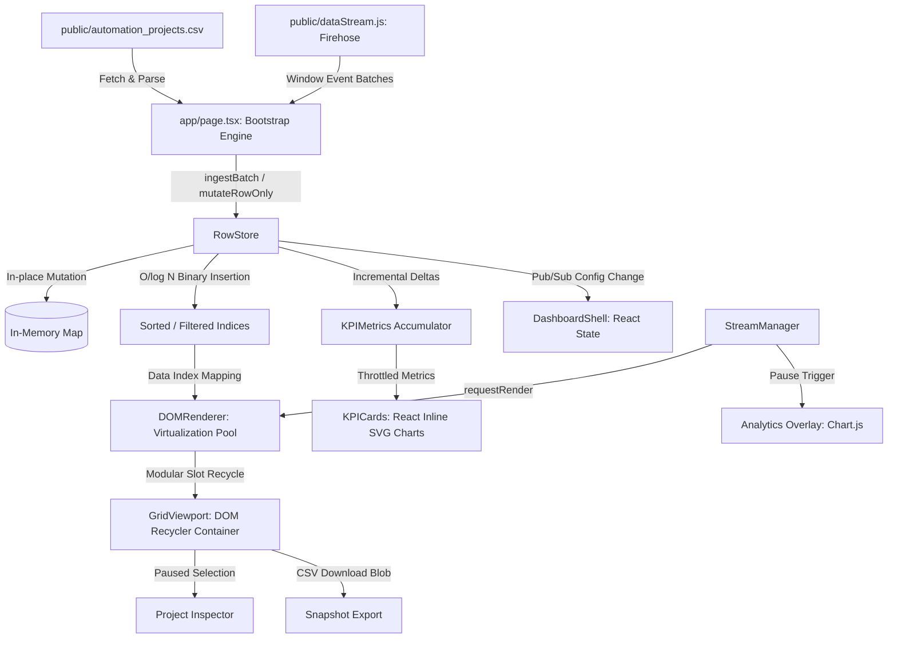

# Architectural Design Document

This document details the software architecture, data flow pipelines, state management, and rendering optimization strategies implemented in **OpsDesk**.

---

## 1. System-Level Data Flow

The following diagram illustrates the unidirectional flow of telemetry data from raw sources to the visual presentation layers:

### Ingestion & Transformation Sequence:
1. **CSV Hydration**: On startup, [page.tsx](file:///c:/Users/ARYAN/OneDrive/Desktop/R2/src/app/page.tsx) fetches the 50,000-row `automation_projects.csv` file, parses it, and loads the initial dataset into the `RowStore` in one batch.
2. **Telemetry Firehose**: The static background script `/public/dataStream.js` establishes an event-driven loop that dispatches batches of telemetry updates via `window.initializeRpaStream`.
3. **In-Memory Transformation**: The `StreamManager` receives these batches and forwards them to the `RowStore`. Row records are parsed, sanitized, and updated in-place.
4. **Index Rebuilding**: If sorting or filtering conditions are met, affected rows are spliced and re-inserted into sorted indexes via binary search algorithms.
5. **DOM Patching**: The `DOMRenderer` maps active index slices to its pre-allocated pool of DOM row nodes, performing minimal text/class diffs before committing writes to the screen.

---

## 2. Component Architectures

### Virtualization Architecture (`DOMRenderer`)
To maintain smooth scrolling at 60 FPS across 50k rows, the custom virtualization engine operates outside the React fiber tree:
- **Modular recycling**: The renderer determines which rows to show by calculating a viewport slice from the container's `scrollTop` (with a buffer of 8 overscan rows above and below). Each visible row index maps to a slot in the fixed DOM pool using a modulo operation:
  $$\text{slotIndex} = \text{rowIndex} \pmod{\text{poolSize}}$$
- **Containment boundaries**: Pre-allocated row elements use the CSS property `contain: layout paint`. This limits layout calculations to the boundary of the individual row, preventing the browser from triggering full-document layout thrashing when rows change position.
- **Cell diff cache**: The renderer stores a copy of the last rendered text content and CSS class for every column. It updates the DOM only if the incoming data differs, bypassing unnecessary writes.
- **Event delegation**: Instead of attaching individual click event listeners to each row element, a single event listener is bound to the parent scroll container. When clicked, it traverses the event target tree to resolve the row ID from the clicked element's metadata attributes.

### State Management Architecture (`RowStore`)
The database acts as a localized, client-side store:
- **No global stores**: Bypasses external state libraries (e.g. Redux, Zustand, Recoil). State is contained within a class-based instance of `RowStore`.
- **Deltas over full scans**: Aggregate metrics (total robots, savings, average ROI) are maintained using incremental delta updates. When a project updates its robot count from 2 to 5, the store adjusts the global total by $+3$ rather than scanning the entire dataset.
- **Binary indexing**: Stored records are indexed in two arrays: `sortedIds` (all projects sorted) and `visibleIds` (projects matching the active search and filter parameters). Both arrays are updated using binary insertion search ($O(\log N)$ complexity).

### Telemetry & Flow Control (`StreamManager`)
The telemetry system manages high-frequency data flows:
- **Flow decoupling**: Decouples network/event ingestion from the UI refresh rate. Ingestion mutations run continuously in the background, while UI rendering is restricted to standard display refresh rates using `requestAnimationFrame`.
- **Progressive unpause draining**: If the stream is paused, incoming updates continue to mutate the `RowStore` in real-time, but UI rendering is suspended and changed IDs are buffered. When resumed, the `StreamManager` drains this buffer in chunks of 50 IDs per frame across consecutive animation cycles to prevent rendering spikes.

### Analytics Architecture (`AnalyticsOverlay`)
Aggregated metrics and analytical visualizations are separated from the live rendering stream:
- **Telemetry Snapshot Freeze**: The analytics overlay is accessible only when the stream is paused. This locks the telemetry data state, preventing layout shifts and chart redraws during inspection.
- **Rules-Engine Insights**: The component runs a rule-based analysis on the paused data snapshot to highlight key performance indicators, such as identifying the highest-performing automation types and industries with the highest savings.
- **Chart.js lifecycle management**: Chart instances are created dynamically within a React `useEffect` hook, bound to HTML5 `<canvas>` nodes, and explicitly torn down using `.destroy()` on close to prevent memory leaks.
