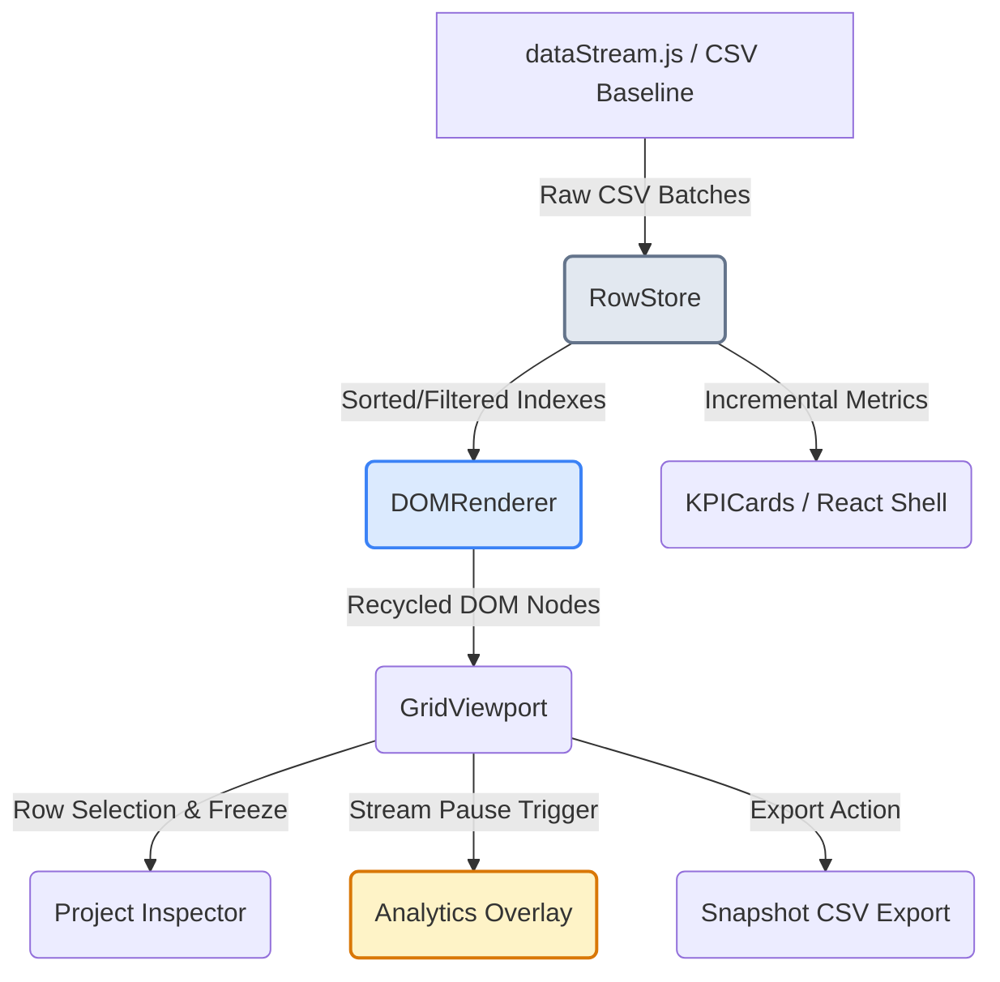

# OpsDesk

OpsDesk is a high-performance, real-time telemetry dashboard designed for monitoring enterprise Robotic Process Automation (RPA) at scale. Engineered to support high-density, real-time data streams without UI degradation, it incorporates a custom-built DOM recycling engine, an incremental in-memory data store, and a comprehensive telemetry visualization suite, all operating entirely client-side.

---

## Challenge Overview

The **High-Density Enterprise RPA Monitor** challenge demands a system capable of handling continuous, high-frequency telemetry updates (~5 updates per second, or hundreds of individual project state mutations per batch) for up to 50,000 baseline projects, without compromising browser responsiveness or scroll smoothness. Traditional rendering strategies (including standard React reconciliation) fail under such throughput due to excessive DOM nodes, garbage collection spikes, and layout thrashing. 

OpsDesk addresses this by bypassing React's virtual DOM for hot path row updates, maintaining telemetry metrics incrementally, and using advanced layout isolation techniques.

---

## Problem Statement

To deliver an enterprise-grade monitor, the solution must satisfy the following core requirements:
- **Scalable Data Ingestion**: Parse and render a 50,000-row baseline CSV dataset, then continuously ingest real-time updates.
- **Zero-Latency Grid Rendering**: Render thousands of active items with smooth scrolling and instantaneous responsiveness.
- **Dynamic Sort and Filter**: Support multi-column sorting (with precedence) and multi-field criteria filtering across the entire dataset.
- **Robust Telemetry Controls**: Allow administrators to pause the telemetry firehose to inspect a project's state without losing backlogged updates.
- **Fully Client-Side Architecture**: Comply with strict client-side deployment constraints—no server runtime, no backend APIs, and no server actions.
- **No Third-Party Virtualization Libraries**: Custom code must handle all row virtualization and scroll recycling.

---

## Architecture Overview

OpsDesk's architecture separates the high-frequency telemetry stream from the React layout tree. The processing and rendering pipeline is divided into five key components:



### 1. RowStore
The single source of truth for the application's data. Implemented as an in-memory map of `Row` records, `RowStore` precomputes search indices and updates multi-field sorting and filtering indexes in $O(\log N)$ time using binary insertion search. It updates all KPI metrics incrementally via deltas during ingestion to avoid costly $O(N)$ full-dataset recalculations.

### 2. DOMRenderer
An imperative, low-level virtualization engine written in TypeScript. It bypasses React and directly manages a fixed pool of absolute-positioned DOM nodes. By comparing cell changes against an internal memory cache before writing to the DOM, it eliminates redundant layout calculations and DOM mutations.

### 3. GridViewport
The React component that hosts the scrollable grid container. It instantiates the `DOMRenderer`, binds container scroll events (coalesced via `requestAnimationFrame`), and manages column header UI, multi-column sorting interactions, and pagination controls.

### 4. Telemetry Pipeline
Managed by the `StreamManager`. It coordinates the data stream from `dataStream.js` into the `RowStore` and schedules updates. When the stream is live, it pushes row-level flashes to the UI. When paused, it continues mutating the `RowStore` but buffers UI updates, which are progressively drained on resume.

### 5. Analytics Overlay
A full-screen analytical reporting dashboard. It computes aggregate distributions (e.g., automation types, savings by industry, project statuses) and renders interactive data visualizations based on the paused telemetry snapshot.

### 6. Snapshot Export
An instant client-side utility that compiles currently visible rows (matching active filters and search queries) and generates an escaped CSV snapshot for immediate download.

---

## Key Features

- **Custom Virtualization Engine**: Pre-allocates a fixed pool of DOM nodes based on viewport size, recycling rows dynamically during scroll using modular mapping (`slotIndex = rowIndex % poolSize`).
- **Real-Time Telemetry Stream**: Processes high-frequency batch updates (e.g., status changes, ROI mutations, robot counts) with synchronized visual cell flashing to draw immediate attention to critical events.
- **Multi-Sort**: Supports sorting across multiple columns simultaneously by holding `Shift` while clicking headers. Columns display numbered badges indicating sort precedence.
- **Tokenized Search**: Split search terms into separate tokens to perform a logical `AND` match across project IDs, project names, companies, countries, and industries.
- **Multi-Field Filters**: Apply combined filtering criteria for Project Status, Automation Type, Department, Industry, Country, AI Enabled, and Cloud Deployment.
- **Local Persistence**: Saves filters, search queries, multi-sort configurations, and sidebar/inspector panel layout preferences to `localStorage`, debounced at 400ms and validated on load.
- **Project Inspector**: Collapsible side panel active only when the telemetry stream is paused. Displays deep operational metrics, financial data, and metadata.
- **Analytics Overlay**: Summarizes complex telemetry distributions with interactive charts (doughnut, horizontal bar, scatter plot, and trend lines) and AI-powered insights.
- **Snapshot Export**: Download current views as pre-formatted, properly escaped CSV files named with a timestamp.

---

## Bounty Tasks

### Bounty Task 1: Project Inspector
- **UI & Entry Point**: Implemented as a collapsible slide-out drawer inside [GridViewport.tsx](file:///c:/Users/ARYAN/OneDrive/Desktop/R2/src/components/GridViewport.tsx#L506-L773) (340px desktop width, full-screen overlay with backdrop on mobile).
- **Trigger Condition**: Selection is locked, and the panel is visible *only* when the stream is paused. Clicking rows while the stream is active alerts the user via a toast to pause the stream first.
- **Features**: 
  - **Key Metrics Grid**: Displays ROI %, Annual Savings, Robots Deployed, and Employee Hours Saved in a structured grid.
  - **Status Indicator Badges**: Clearly shows project status alongside metadata properties like AI Core Integration and Cloud Deployment.
  - **Categorized Accordion Panels**: Divides granular row fields into three collapsible sections:
    1. *Operations*: Displays implementation partner and automation type.
    2. *Financials*: Displays budget, annual savings, and average ROI.
    3. *Deployment & Metadata*: Displays department, country, company ID, start date, and completion date.

### Bounty Task 2: Analytics Overlay
- **UI & Entry Point**: Accessible via a dedicated "Analytics View" button in the [ControlBar.tsx](file:///c:/Users/ARYAN/OneDrive/Desktop/R2/src/components/ControlBar.tsx#L168-L178) (visible only when the stream is paused) and inside [AnalyticsOverlay.tsx](file:///c:/Users/ARYAN/OneDrive/Desktop/R2/src/components/AnalyticsOverlay.tsx).
- **Visualization Suite**: Configured with 5 distinct charts powered by `Chart.js`:
  1. *Automation Type Distribution* (Doughnut Chart)
  2. *Savings by Industry* (Horizontal Bar Chart)
  3. *Project Lifecycle Breakdown* (Doughnut Chart: Active vs. Completed vs. Planned)
  4. *ROI vs. Budget Allocation* (Scatter Plot with custom tooltips)
  5. *Savings Trend Over Time* (Line/Area Chart showing daily savings)
- **AI-Powered Insights**: Uses a rules engine to extract high-value insights from the active snapshot (e.g., Highest ROI Industry, Highest Savings Industry, Most Active Automation, At-Risk Projects).
- **Sparklines**: Features inline SVG sparkline micro-charts inside the summary KPI cards.

### Bounty Task 3: Snapshot Export
- **CSV Compilation**: Implemented inside [GridViewport.tsx](file:///c:/Users/ARYAN/OneDrive/Desktop/R2/src/components/GridViewport.tsx#L63-L132). It extracts the IDs from `store.visibleIds`, grabs the corresponding data objects from `store.store`, and compiles them into a CSV payload.
- **Escaping & Safety**: Incorporates custom character escaping logic (`escapeCSVCell`) to handle commas, double quotes, and carriage returns safely.
- **Interactive Reports Tab**: A dedicated navigation screen ([ReportsTab.tsx](file:///c:/Users/ARYAN/OneDrive/Desktop/R2/src/components/ReportsTab.tsx)) allowing users to configure specific target parameters and select output formats (e.g., CSV, JSON) for instant reporting.

---

## Performance Strategy

To maintain a responsive UI at 60 FPS under continuous telemetry load, OpsDesk utilizes the following optimizations:

1. **DOM Recycling**: Rather than destroying and mounting DOM elements as the user scrolls, a pre-computed pool of row `div` nodes is recycled. Only `translateY` and internal cell values are updated.
2. **Cell-Level Caching**: The `DOMRenderer` maintains a cache of the last rendered value and CSS class for every slot. During updates, the DOM is mutated *only* if the new value or class differs from the cached value, bypassing redundant rendering.
3. **Progressive Update Draining**: When resuming the stream after a pause, the backlog of updates in `pendingChangedIds` is drained in small chunks (capped at 50 IDs per frame) across consecutive animation frames, preventing frame drops.
4. **CSS Containment**: Row elements are initialized with `contain: layout paint`. This instructs the browser's layout engine that the row contents are isolated, preventing style mutations from triggering page-wide reflows.
5. **Memory-Safe Chart Lifecycle**: In the `AnalyticsOverlay`, all Chart.js instances are registered, initialized in a `useEffect` closure, and explicitly destroyed using `.destroy()` during component unmount, preventing heap leaks.

---

## Technology Stack

- **Framework**: [Next.js 16 (App Router)](https://nextjs.org/)
- **Core Library**: [React 19](https://react.dev/)
- **Programming Language**: [TypeScript](https://www.typescriptlang.org/)
- **Styling**: [Tailwind CSS v4](https://tailwindcss.com/) (integrated via PostCSS)
- **Data Visualization**: [Chart.js v4](https://www.chartjs.org/) (confined strictly to the Analytics Overlay)
- **Stream Ingestion**: Native RequestAnimationFrame & window-scoped firehose streams

---

## Local Development

Ensure you have [Node.js (v18+)](https://nodejs.org/) installed.

1. **Clone the repository**:
   ```bash
   git clone https://github.com/AryanUbale7/OpsDesk.git
   cd OpsDesk
   ```

2. **Install dependencies**:
   ```bash
   npm install
   ```

3. **Run the development server**:
   ```bash
   npm run dev
   ```

4. **Access the application**:
   Open [http://localhost:3000](http://localhost:3000) in your web browser.

---

## Screenshots

> [!NOTE]
> High-resolution visual captures and layouts of the dashboard panels:

| Dashboard Overview (Live Stream) | Analytics Overlay (Frozen Telemetry) |
| :---: | :---: |
|  |  |

---

## Submission Links

- **GitHub Repository**: [https://github.com/AryanUbale7/OpsDesk](https://github.com/AryanUbale7/OpsDesk)
- **Live Deployment**: *[Link to be provided upon hosting deployment]*
- **Video Walkthrough**: *[Link to be provided upon recording submission walkthrough]*

---

## Engineering Notes for Evaluators

### Why custom virtualization was built
Standard React-based rendering components re-evaluate the virtual DOM and trigger reconciliation loops for every single state update. Under high-frequency telemetry (200ms batches containing dozens of row updates), React's reconciliation engine becomes a performance bottleneck. The custom `DOMRenderer` operates imperatively, bypassing the React fiber tree entirely for hot path cell writes.

### Why no virtualization libraries were used
Third-party libraries like `react-window` or `react-virtualized` are designed for static or low-frequency updates, relying on React reconciliation to render rows. They lack native support for targeted cell-level update flashing or direct O(K) row patch updates. Building a custom renderer allowed us to implement cell caches and O(K) delta updates directly.

### Why the architecture is fully client-side
By running the ingestion, index manipulation, and sorting/filtering algorithms fully in-memory client-side, we avoid the overhead of network requests and database lookups. This enables instantaneous sorting and filtering over the 50,000-row dataset.

### How telemetry remains responsive
During a paused state, the telemetry firehose continues to mutate the data in `RowStore`, maintaining real-time accuracy under the hood. Only the rendering pipeline is throttled. When unpaused, the `StreamManager` drains the accumulated changes progressively over several frames using `requestAnimationFrame`, preventing UI blocking.

### How memory leaks are prevented
- Eviction limits are capped strictly at 5,000 rows, avoiding memory exhaustion.
- Event listeners are unbound, and timers/animation frames are cleared via component cleanup functions.
- Chart.js chart instances are explicitly destroyed upon closing the overlay.
